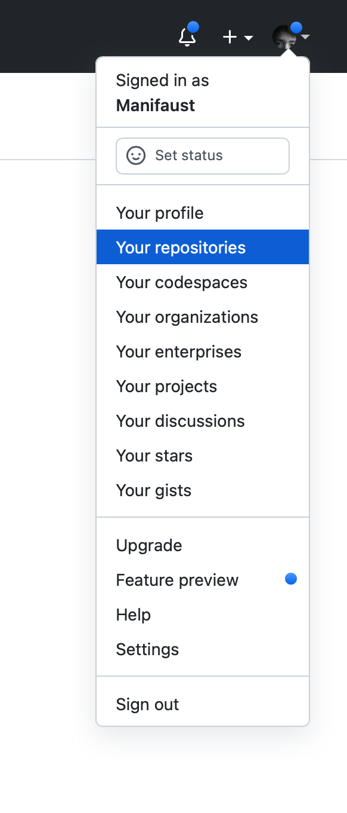
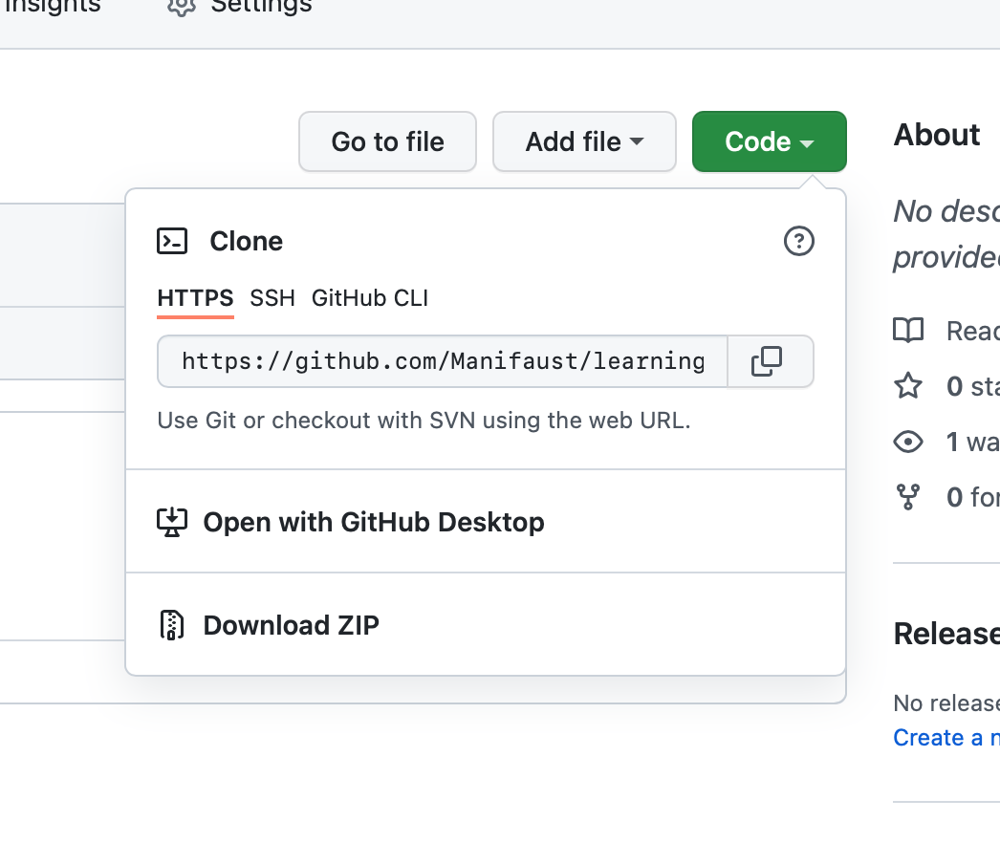
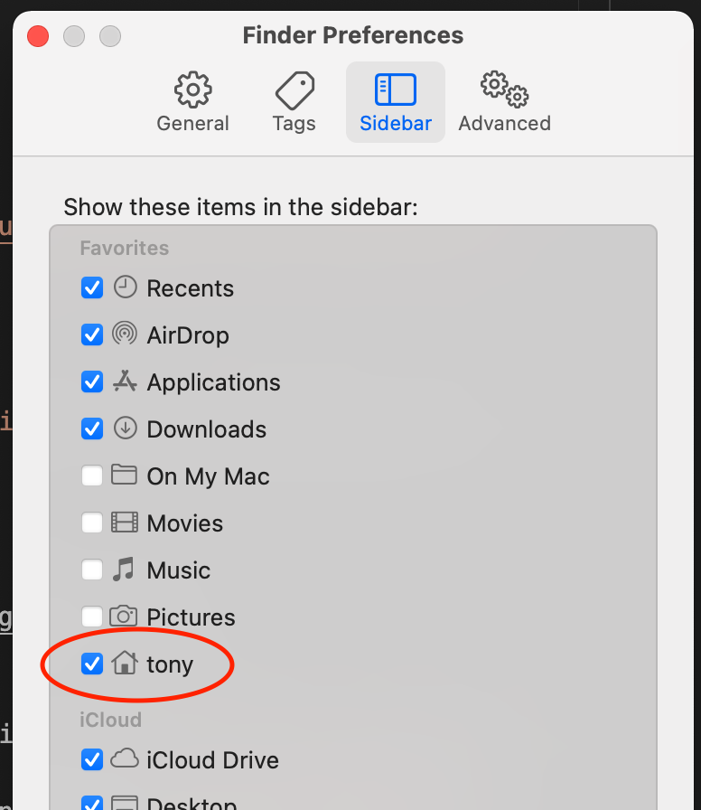
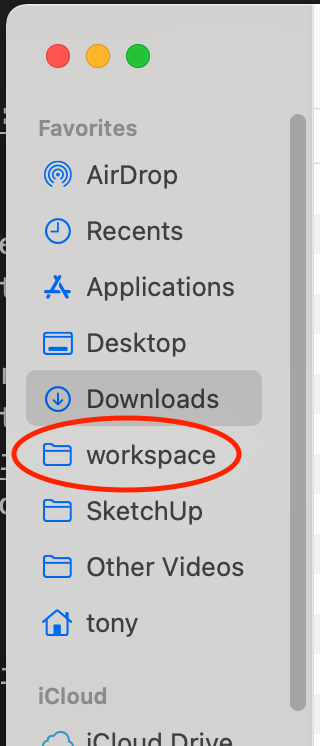

# Working with GitHub and git

## Create your own GitHub project

Go to Your Repositories.



Click New. For repository name, you can type what ever you want, for this examples we'll use `learning-project`. For visibility select Public to make future access easier. 

Under *Initialize this repository with*, select *Add a README file*. This will create an initial README as well as a initial git commit.

Click Create repository.

## Clone the repository to your computer

In the repository page for `learning-project`, click Code, and select HTTPS. Copy that URL. For example, my URL is `https://github.com/Manifaust/learning-project.git`.



Clone the `learning-project` repo using the `git` CLI or the desktop app. You'll need to type in your password.

```
cd ~/workspace
git clone https://github.com/Manifaust/learning-project.git
```

This will create a new directory in your workspace directory named learning-project, and clone the repository contents into that directory.

Git will ask for your password for many operations, such as clone, pull, push. If you don't want to keep typing in your password you can [follow instructions](https://docs.github.com/en/authentication/connecting-to-github-with-ssh) to connect using your own SSH key.

## Make getting to your project easier

In your text editor, open up your learning-project folder. 

To make that easier you should probably put your workspace folder as a favorite in the Finder sidebar. First open up Finder, then go to preferences. In the Sidebar pane, click the checkbox to your home folder (it has your name on it).



Now your home folder will be on the Favorite section of your Finder's sidebar. Click on the home folder icon and you'll see the workspace directory you created earlier. Click-and-drag the workspace directory into the sidebar as well. This makes navigating to the workspace easier when using desktop applications.



## Make edits using a text editor

Open your text editor, then navigate to your workspace and open the learning-project directory.

Open `README.md` and make some changes.

## Stage and commit your changes

Go back to the terminal and navigate to your learning-project directory.

```sh
cd ~/workspace/learning-project
```

To get an overview of what changes you've made, use `git status`.

For example:

```sh
$ git status
On branch main
Your branch is up to date with 'origin/main'.

Changes not staged for commit:
  (use "git add <file>..." to update what will be committed)
  (use "git restore <file>..." to discard changes in working directory)
	modified:   README.md

no changes added to commit (use "git add" and/or "git commit -a")
```

This tells me that `README.md` has changed, and that I haven't staged those changes yet.

* *Staging* a file means to make include changes to that file in the next commit.
* *Making a commit* means to take all the staged changes and make an official record of them on your computer, along with a *commit message*. You can think of commits as snapshots in time.
* *Pushing* a commit or set of commits means to upload them to GitHub and make it visible for others to see.

Stage the changes we mad to `README.md` using `git add`.

```sh
git add README.md
```

For example:

```sh
$ git add README.md
$ git status
On branch main
Your branch is up to date with 'origin/main'.

Changes to be committed:
  (use "git restore --staged <file>..." to unstage)
	modified:   README.md
```

Git tells us that `README.md` has been stages. And it will be included in the next commit. Now lets commit the change using `git commit`.

```sh
git commit -m <some message>
```

`git commit` takes a commit message that gets recorded along with the related changes.

For example:

```sh
$ git commit -m "Improved README"

[main 56133e2] Improved README
 1 file changed, 3 insertions(+), 1 deletion(-)
$ git status
On branch main
Your branch is ahead of 'origin/main' by 1 commit.
  (use "git push" to publish your local commits)
```

Now we will push the changes using `git push`. For example:

```sh
git push
Enumerating objects: 5, done.
Counting objects: 100% (5/5), done.
Writing objects: 100% (3/3), 289 bytes | 289.00 KiB/s, done.
Total 3 (delta 0), reused 0 (delta 0), pack-reused 0
To github.com:/Manifaust/learning-project.git
   843828f..56133e2  main -> main
```

Now that our changes have been pushed. When you go back to the project page on GitHub, you'll see that the files have been updated. And the history includes your latest commit, which shows the commit message.