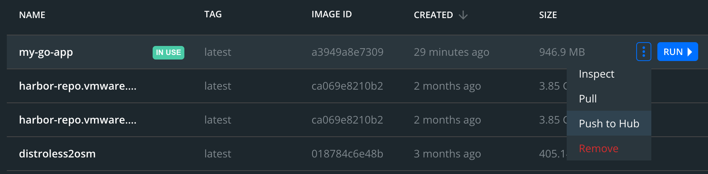

# Docker

## Create a container image

*This example is from [Elliot Forbes on tutorialedge.net](https://tutorialedge.net/golang/go-docker-tutorial/).*

Start up Docker Desktop. 

Paste the following into a new file named `Dockerfile`. This file tells Docker how to build an image. First it copies or `ADD`s the server code files you wrote earlier. Then it will build those files into a binary. Then it will configure the image to execute that binary when someone starts running that image.

```dockerfile
## We specify the base image we need for our
## go application
FROM golang

## We create an /app directory within our
## image that will hold our application source
## files
RUN mkdir /app

## We copy everything in the root directory
## into our /app directory
ADD . /app

## We specify that we now wish to execute 
## any further commands inside our /app
## directory
WORKDIR /app

## we run go build to compile the binary
## executable of our Go program
RUN go build -o main .

## Our start command which kicks off
## our newly created binary executable
CMD ["/app/main"]
```

Use `docker build`. 

```sh
docker build -t my-go-app .
```

`my-go-app` is the name we want for the image, and the `.` at the end means use the `Dockerfile` that's found in the current directory.

Use `docker image list` to see some information about your newly built image. For example:

```sh
$ docker image list
REPOSITORY   TAG      IMAGE ID       CREATED         SIZE
my-go-app    latest   a3949a8e7309   6 minutes ago   947MB
```

Run the image using `docker run`. This command will run the image indefinitely and take over your terminal. To stop the server and regain control of the termainl, hit Ctrl-C.

```sh
docker run -p 80:80 -it my-go-app
```

This commands creates a container to run the image, and forwards all traffic from port 80 from the container to port 80 on your local machine, and vise versa.

While the server is running, go to your browser and go to [`http://localhost`](http://localhost) again. You should see the same message you saw before.

Your request is forwarded to running container. The container already has the server running listening to the right port, and creates a response. The container then forwards that response back to the browser.

Finish up by staging your Dockerfile, commiting it, and pushing it.

## Push the image to Docker Hub

To make the image accessible other people, use the Docker Desktop app, navigate to your image, and select Push to Hub.



Alternatively you can use the terminal.

First login:

```sh
$ docker login
<follow the prompts>
```

Before pushing to Dockerhub (or any other registry), you have to give your image a name that contains the project and  repository that the registry recognizes, and which you have permission to push to.

```sh
$ docker tag docker tag my-go-app:latest manifaust/my-go-app:latest
```

Replace `manifaust` with your Dockerhub username. `my-go-app` is the image name and `latest` is the image tag, both can be changed to whatever you want.

Now push the image to Dockerhub.

```sh
$ docker push manifaust/my-go-app:latest
```

Replace `manifaust` with your username.

When the command finish your image is available on Dockerhub. You can see it in [https://hub.docker.com/r/manifaust/my-go-app](https://hub.docker.com/r/manifaust/my-go-app) (replace `manifaust` with your username).

If your friend wants to run your application, you can tell them to execute `docker run` pointing to your image name:

```sh
docker run -p 80:80 -it manifaust/my-go-app:latest
```

Now they can run your server without setting up Go, or even know what language it's written in or what dependencies it has.

Even though that name doesn't specify Dockerhub, it'll look for the image on Dockerhub by default. If you're using another registry, the name will have to be fully spelled out to include that registry's URL.